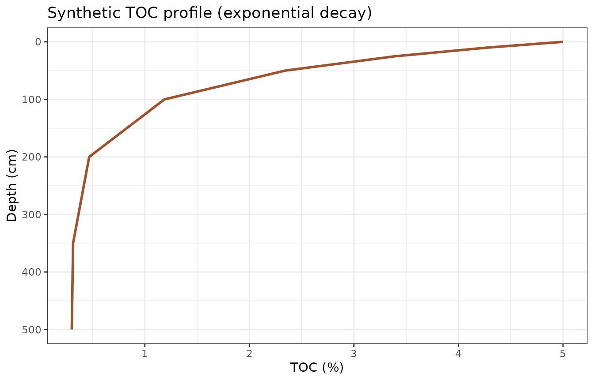
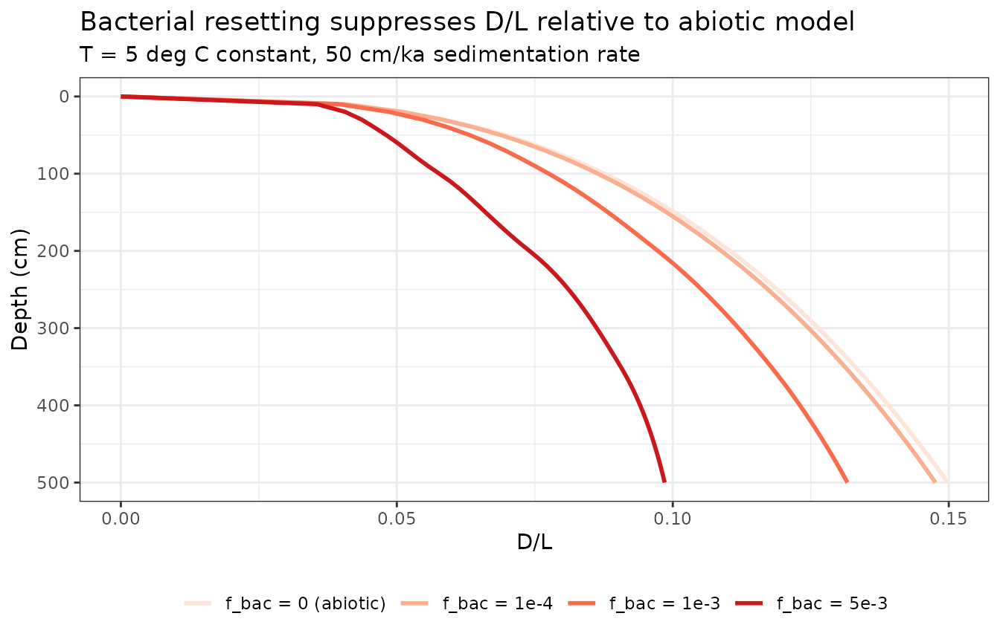
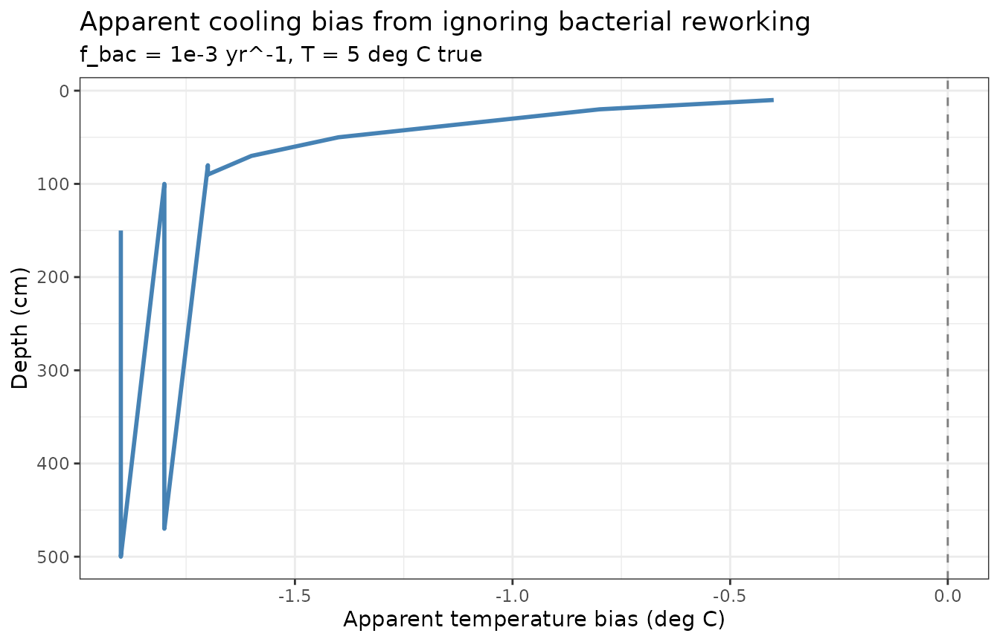
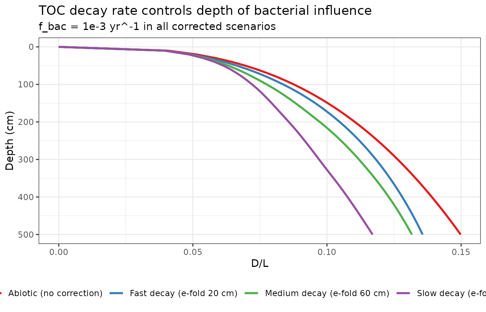

# Bacterial Resetting of D/L Ratios

## Biological reworking of amino acids

Braun et al. (2017) showed that bacteria in marine sediments
continuously recycle amino acids: they consume D-form amino acids from
necromass and synthesize new L-form amino acids, pulling D/L ratios
below the values that pure abiotic racemization would predict. The
magnitude of this effect scales with organic carbon availability, which
decreases with depth as organic matter is degraded.

The AARP model now includes an optional bacterial resetting term. At
each integration timestep `dt`, the accumulated D/L in power-law space
(Rx) evolves as:

    Rx(t+dt) = Rx(t)
               + dRacPL(kt, dt)                           # abiotic racemization
               - f_bac * (TOC(z) / TOC_surface) * Rx * dt  # bacterial resetting

The single free parameter `f_bac` (yr^-1) is the surface resetting rate.
Local TOC normalised to the surface value scales the effect with depth:
high near the surface where organic matter is abundant; low in old,
organic-depleted sediment. Based on necromass turnover times of hundreds
to thousands of years reported by Braun et al. (2017), plausible values
range from 1e-4 to 1e-2 yr^-1.

## TOC profile

We build a synthetic but realistic downcore TOC profile using an
exponential decay model. TOC drops steeply in the top ~50 cm, then
levels off to a recalcitrant baseline:

``` r

# Exponential decay: TOC_0 = 5% at surface, asymptote ~0.3%
depths_toc <- c(0, 10, 25, 50, 100, 200, 350, 500)
toc_vals   <- 0.3 + 4.7 * exp(-depths_toc / 60)

toc_fn <- make_toc_model(depth_cm = depths_toc, toc_pct = toc_vals)

data.frame(depth_cm = seq(0, 500, 5),
           toc      = toc_fn(seq(0, 500, 5))) |>
  ggplot(aes(x = toc, y = depth_cm)) +
  geom_line(colour = "sienna", linewidth = 1) +
  scale_y_reverse() +
  labs(x = "TOC (%)", y = "Depth (cm)",
       title = "Synthetic TOC profile (exponential decay)") +
  theme_bw()
```



## Effect on D/L profiles

Compare D/L profiles for a range of `f_bac` values spanning the
estimates from Braun et al. (2017). All scenarios use the same
temperature (5 deg C constant) and sedimentation rate (50 cm/ka):

``` r

am     <- rate_to_age_model(rate_cm_per_ka = 50, max_depth_cm = 500)
depths <- seq(0, 500, by = 10)

f_bac_vals <- c(0, 1e-4, 1e-3, 5e-3)
labels     <- c("f_bac = 0 (abiotic)", "f_bac = 1e-4", "f_bac = 1e-3", "f_bac = 5e-3")

res <- lapply(seq_along(f_bac_vals), function(j) {
  out <- racemize_depth_series(depths,
                               age_model = am,
                               temp_model = 5,
                               toc_model  = toc_fn,
                               f_bac      = f_bac_vals[j])
  out$scenario <- labels[j]
  out
})

do.call(rbind, res) |>
  mutate(scenario = factor(scenario, levels = labels)) |>
  ggplot(aes(x = DL, y = depth_cm, colour = scenario)) +
  geom_line(linewidth = 1) +
  scale_y_reverse() +
  scale_colour_brewer(palette = "Reds") +
  labs(x = "D/L", y = "Depth (cm)", colour = NULL,
       title = "Bacterial resetting suppresses D/L relative to abiotic model",
       subtitle = "T = 5 deg C constant, 50 cm/ka sedimentation rate") +
  theme_bw() +
  theme(legend.position = "bottom")
```



The strongest resetting occurs near the surface where TOC is highest. At
depth, as TOC approaches the recalcitrant baseline, the bacterial effect
diminishes and profiles converge toward the abiotic curve.

## Implied temperature bias

If bacterial reworking is real but ignored during temperature
reconstruction, the forward model will attribute lower-than-expected D/L
to a cooler temperature rather than to biological resetting. This
creates an apparent cooling bias. We can quantify this by asking: at
what temperature would the abiotic model produce the same D/L profile as
a bacterially corrected model at 5 deg C?

``` r

# True scenario: 5 deg C + bacterial resetting at f_bac = 1e-3
true_with_bac <- racemize_depth_series(depths, am, temp_model = 5,
                                        toc_model = toc_fn, f_bac = 1e-3)

# Find apparent temperature (abiotic model) that minimises squared deviation
# at each depth independently, using a simple grid search
T_grid <- seq(1, 10, by = 0.1)
apparent_T <- sapply(seq_along(depths), function(di) {
  target_DL <- true_with_bac$DL[di]
  if (target_DL == 0) return(NA_real_)
  abiotic_DL <- sapply(T_grid, function(T) {
    racemize_depth_series(depths[di], am, temp_model = T)$DL
  })
  T_grid[which.min((abiotic_DL - target_DL)^2)]
})

bias_df <- data.frame(
  depth_cm   = depths,
  apparent_T = apparent_T,
  true_T     = 5,
  bias_C     = apparent_T - 5
) |> filter(!is.na(apparent_T))

ggplot(bias_df, aes(x = bias_C, y = depth_cm)) +
  geom_vline(xintercept = 0, linetype = "dashed", colour = "grey50") +
  geom_line(colour = "steelblue", linewidth = 1) +
  scale_y_reverse() +
  labs(x = "Apparent temperature bias (deg C)", y = "Depth (cm)",
       title = "Apparent cooling bias from ignoring bacterial reworking",
       subtitle = "f_bac = 1e-3 yr^-1, T = 5 deg C true") +
  theme_bw()
```



The bias is largest in young, shallow sediment (where TOC is high and
bacterial activity is greatest) and diminishes with depth. For
`f_bac = 1e-3` yr^-1, the surface bias can reach 1-2 deg C, while old,
deep sediment converges toward the true temperature.

## Sensitivity to TOC decay rate

The shape of the TOC profile matters. A faster decay (TOC drops quickly
to background) concentrates the bacterial effect near the surface. A
slower decay (gradual decline to background) produces a more uniform
correction:

``` r

toc_fast <- make_toc_model(depths_toc, 0.3 + 4.7 * exp(-depths_toc / 20))
toc_slow <- make_toc_model(depths_toc, 0.3 + 4.7 * exp(-depths_toc / 150))

scens <- list(
  list(fn = toc_fast, label = "Fast decay (e-fold 20 cm)"),
  list(fn = toc_fn,   label = "Medium decay (e-fold 60 cm)"),
  list(fn = toc_slow, label = "Slow decay (e-fold 150 cm)")
)

res2 <- lapply(scens, function(s) {
  out <- racemize_depth_series(depths, am, temp_model = 5,
                               toc_model = s$fn, f_bac = 1e-3)
  out$scenario <- s$label
  out
})

abiotic <- racemize_depth_series(depths, am, temp_model = 5)
abiotic$scenario <- "Abiotic (no correction)"

bind_rows(do.call(rbind, res2), abiotic) |>
  mutate(scenario = factor(scenario,
    levels = c("Abiotic (no correction)", "Fast decay (e-fold 20 cm)",
               "Medium decay (e-fold 60 cm)", "Slow decay (e-fold 150 cm)"))) |>
  ggplot(aes(x = DL, y = depth_cm, colour = scenario)) +
  geom_line(linewidth = 1) +
  scale_y_reverse() +
  scale_colour_brewer(palette = "Set1") +
  labs(x = "D/L", y = "Depth (cm)", colour = NULL,
       title = "TOC decay rate controls depth of bacterial influence",
       subtitle = "f_bac = 1e-3 yr^-1 in all corrected scenarios") +
  theme_bw() +
  theme(legend.position = "bottom")
```



## Practical guidance

- **If TOC data are available**, construct a `toc_model` with
  [`make_toc_model()`](https://nickmckay.github.io/AARP/reference/make_toc_model.md)
  and run sensitivity analyses across `f_bac = c(0, 1e-4, 1e-3, 5e-3)`
  to bracket the plausible range of bacterial influence.

- **Marine sediments** (Braun et al. 2017 context): bacterial effects
  are significant, with `f_bac` likely 1e-3 to 1e-2 yr^-1.

- **Cold, oligotrophic lake sediments** (low TOC, low temperature):
  bacterial activity is much lower. TOC \< 1% and temperatures near 4
  deg C suggest `f_bac` closer to 1e-4 yr^-1 or smaller.

- **Default behaviour** (`f_bac = 0`): pure abiotic racemization,
  identical to all prior results. Bacterial correction is strictly
  opt-in.

- Braun et al. (2017) note that D/L ratios in marine sediments are
  always lower than pure racemization predicts. In Holocene lake
  sediments where D/L ratios have had less time to accumulate, this bias
  may be relatively small compared to the temperature signal of
  interest, but should be checked. \`\`\`
