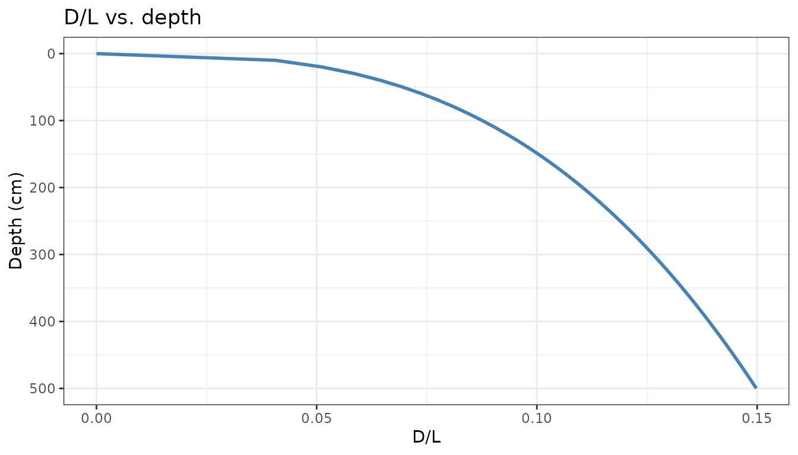
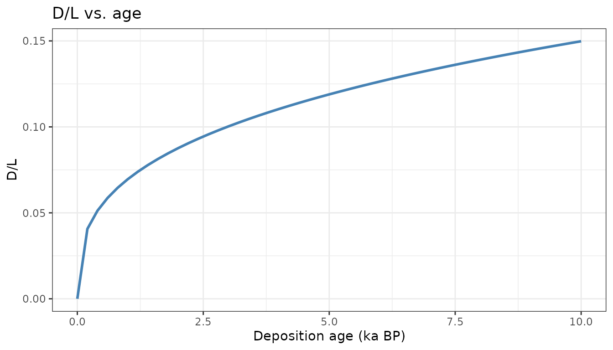
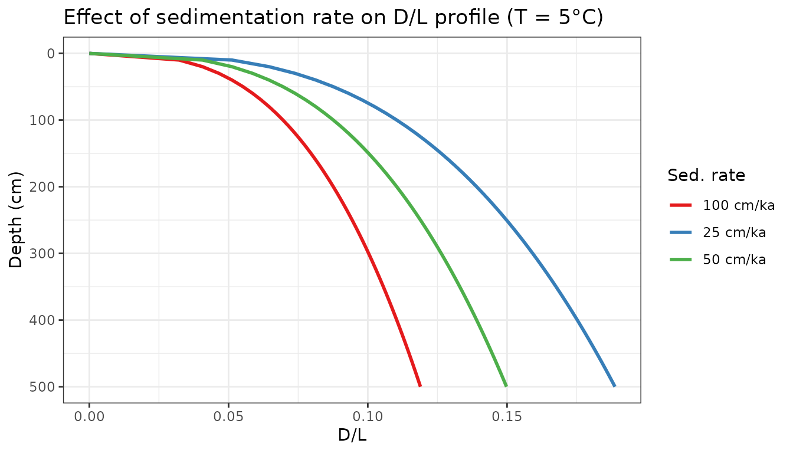
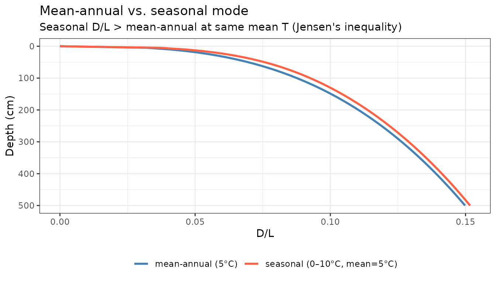
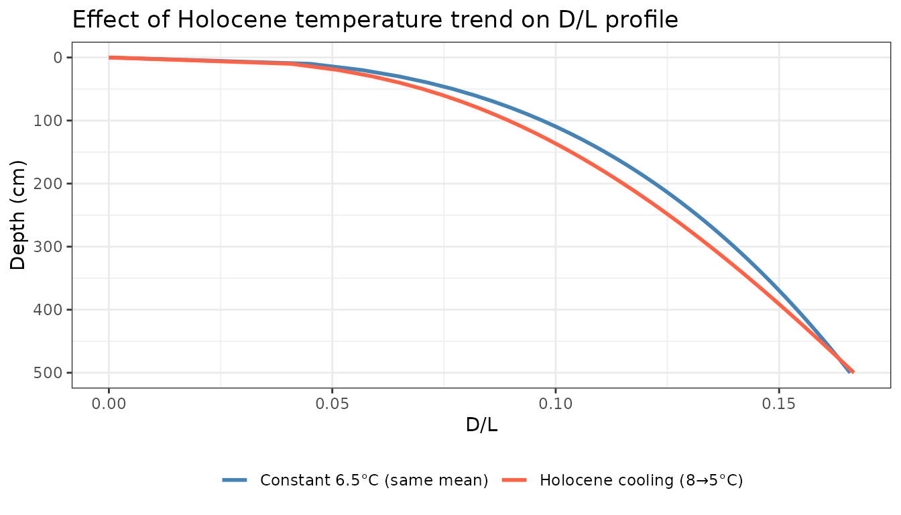

# Depth-Series Forward Model

## Age-depth models

The depth-series model needs to convert between sample depth (what you
measure in the lab) and sample age (what drives racemization). The
simplest case is a constant sedimentation rate:

``` r

# 50 cm/ka sedimentation rate; 10 ka core = 500 cm
am <- rate_to_age_model(rate_cm_per_ka = 50, max_depth_cm = 500)

# Verify the round-trip
am$depth_to_age(250)  # should be 5 ka
#> [1] 5
am$age_to_depth(5)    # should be 250 cm
#> [1] 250
```

For a real core with radiocarbon-dated horizons, supply the tie-points
directly:

``` r

am_real <- make_age_model(
  depth_cm = c(  0,  45, 120, 280, 420),
  age_ka   = c(  0,   1,   3,   7,  10)
)

depths <- seq(0, 420, by = 5)
plot(am_real$depth_to_age(depths), depths, type = "l",
     xlab = "Age (ka BP)", ylab = "Depth (cm)", main = "Piecewise age-depth model",
     ylim = rev(range(depths)))
```


## Sanity check: constant temperature, constant rate

With a constant sedimentation rate and constant bottom water
temperature, D/L should increase monotonically with depth (older = more
racemized) and with age:

``` r

am     <- rate_to_age_model(rate_cm_per_ka = 50, max_depth_cm = 500)
depths <- seq(0, 500, by = 10)
out    <- racemize_depth_series(depths, age_model = am, temp_model = 5)

ggplot(out, aes(x = DL, y = depth_cm)) +
  geom_line(colour = "steelblue", linewidth = 1) +
  scale_y_reverse() +
  labs(x = "D/L", y = "Depth (cm)", title = "D/L vs. depth") +
  theme_bw()
```



``` r


ggplot(out, aes(x = deposition_age_ka, y = DL)) +
  geom_line(colour = "steelblue", linewidth = 1) +
  labs(x = "Deposition age (ka BP)", y = "D/L", title = "D/L vs. age") +
  theme_bw()
```



The shape of the D/L-vs-age curve reflects the power-law kinetics:
fastest accumulation when D/L is low (fresh sediment), slowing
progressively as D/L rises.

## Effect of sedimentation rate

Higher sedimentation rates spread the same age range over more depth,
shifting the D/L profile to greater depths. Comparing three rates with
the same bottom water temperature:

``` r

rates  <- c(25, 50, 100)  # cm/ka
depths <- seq(0, 500, by = 10)

res <- lapply(rates, function(r) {
  am  <- rate_to_age_model(rate_cm_per_ka = r, max_depth_cm = 500)
  out <- racemize_depth_series(depths, age_model = am, temp_model = 5)
  out$rate_cm_ka <- r
  out
})

do.call(rbind, res) |>
  mutate(rate_label = paste(rate_cm_ka, "cm/ka")) |>
  ggplot(aes(x = DL, y = depth_cm, color = rate_label)) +
  geom_line(linewidth = 1) +
  scale_y_reverse() +
  scale_color_brewer(palette = "Set1") +
  labs(x = "D/L", y = "Depth (cm)", color = "Sed. rate",
       title = "Effect of sedimentation rate on D/L profile (T = 5°C)") +
  theme_bw()
```



At high sedimentation rates, the core samples a shorter time period for
a given depth, so D/L values are lower throughout.

## Mean-annual vs. seasonal mode

The seasonal mode applies thermal diffusion attenuation to the
summer/winter anomaly. Samples at shallow depths experience stronger
seasonal forcing; deeper (older) samples converge to the mean annual
temperature. The Arrhenius nonlinearity means seasonality always
increases D/L relative to the mean-annual case with the same mean
temperature.

``` r

am     <- rate_to_age_model(rate_cm_per_ka = 50, max_depth_cm = 500)
depths <- seq(0, 500, by = 5)

# Mean-annual mode: constant 5°C
out_ann <- racemize_depth_series(depths, age_model = am, temp_model = 5)

# Seasonal mode: same mean T but ±5°C seasonality
out_sea <- racemize_depth_series(depths,
                                 age_model  = am,
                                 temp_model = 5,
                                 sumT_model = 10,
                                 winT_model = 0)

bind_rows(
  mutate(out_ann, mode = "mean-annual (5°C)"),
  mutate(out_sea, mode = "seasonal (0–10°C, mean=5°C)")
) |>
  ggplot(aes(x = DL, y = depth_cm, color = mode)) +
  geom_line(linewidth = 1) +
  scale_y_reverse() +
  scale_color_manual(values = c("steelblue", "tomato")) +
  labs(x = "D/L", y = "Depth (cm)", color = NULL,
       title = "Mean-annual vs. seasonal mode",
       subtitle = "Seasonal D/L > mean-annual at same mean T (Jensen's inequality)") +
  theme_bw() +
  theme(legend.position = "bottom")
```



Note that the gap narrows with depth: by ~300 cm (~6 ka at 50 cm/ka),
the annual diffusion e-folding depth (~0.71 m for $`\kappa`$ = 1.6
m²/yr) has attenuated the seasonal signal substantially, and both curves
converge.

## Time-varying temperature

For a Holocene cooling scenario, pass a data frame to `temp_model`:

``` r

am     <- rate_to_age_model(rate_cm_per_ka = 50, max_depth_cm = 500)
depths <- seq(0, 500, by = 10)

# Linear cooling from 8°C at 10 ka to 5°C at present
cooling_hist <- data.frame(age_ka = c(0, 10), temp_C = c(5, 8))

out_cool <- racemize_depth_series(depths, age_model = am,
                                   temp_model = cooling_hist)
out_flat <- racemize_depth_series(depths, age_model = am,
                                   temp_model = 6.5)  # same mean

bind_rows(
  mutate(out_cool, scenario = "Holocene cooling (8→5°C)"),
  mutate(out_flat, scenario = "Constant 6.5°C (same mean)")
) |>
  ggplot(aes(x = DL, y = depth_cm, color = scenario)) +
  geom_line(linewidth = 1) +
  scale_y_reverse() +
  scale_color_manual(values = c("steelblue", "tomato")) +
  labs(x = "D/L", y = "Depth (cm)", color = NULL,
       title = "Effect of Holocene temperature trend on D/L profile") +
  theme_bw() +
  theme(legend.position = "bottom")
```



The cooling scenario produces higher D/L at depth (older samples
experienced warmer temperatures early in their history), even though
both profiles have the same time-averaged temperature. This is the
signal the inversion framework is designed to detect. \`\`\`
