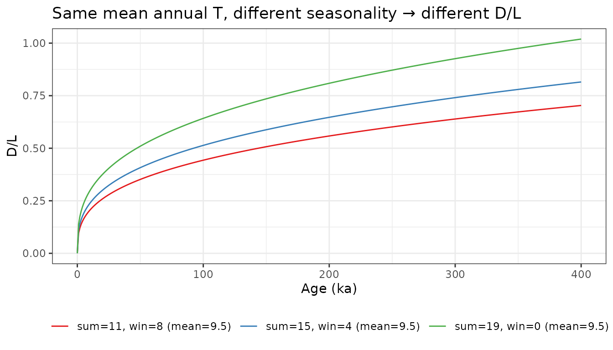
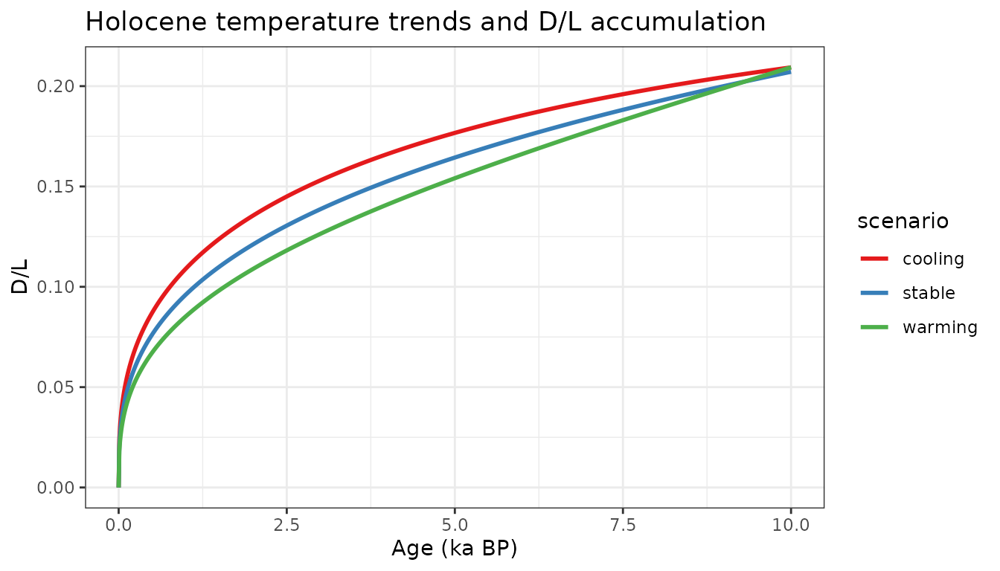

# Racemization Fundamentals

## The Arrhenius equation

Amino acid racemization is a temperature-dependent chemical reaction.
The rate constant $`k`$ at temperature $`T`$ (Kelvin) follows the
Arrhenius equation:

``` math
\ln(k) = -\frac{E_a}{R} T^{-1} + \ln(A_e)
```

The
[`arrhenius()`](https://nickmckay.github.io/AARP/reference/arrhenius.md)
function implements this with literature defaults ($`A_e = e^{42.12}`$,
$`E_a = 31.5`$ kcal/mol):

``` r

T_C  <- seq(-5, 25, by = 1)
kt   <- arrhenius(Temp = T_C + 273)

plot(T_C, kt, type = "l", xlab = "Temperature (°C)", ylab = "Rate constant k",
     main = "Arrhenius rate constant for isoleucine epimerization")
```


The exponential dependence on $`1/T`$ means small temperature
differences have large effects on racemization rate — a 5°C warming
roughly doubles $`k`$ near lake bottom-water temperatures.

## The power-law linearization

Racemization is integrated in $`(D/L)^x`$ space rather than $`D/L`$
space (the Bada linearization). This converts the sigmoidal D/L
accumulation curve into a linear one, making the relationship
$`D/L^x = k_T t + C`$ tractable:

``` r

dT  <- 10         # 10-year timestep
age <- seq(0, 400, by = dT) / 1000  # ka

# Accumulate racemization at constant 5°C
kt  <- arrhenius(Temp = 5 + 273)
Rx  <- cumsum(c(0, rep(dRacPL(kt, dT), length(age) - 1)))

data.frame(age_ka = age, Rx = Rx, DL = Rx^(1/3)) |>
  (\(d) {
    par(mfrow = c(1, 2))
    plot(d$age_ka, d$Rx,  type = "l", xlab = "Age (ka)", ylab = expression((D/L)^x),
         main = "Linear in power-law space")
    plot(d$age_ka, d$DL,  type = "l", xlab = "Age (ka)", ylab = "D/L",
         main = "Sigmoidal in D/L space")
    par(mfrow = c(1, 1))
  })()
```


## Effect of seasonality

Because the Arrhenius relationship is nonlinear (exponential in
$`1/T`$), two climates with the same mean annual temperature but
different seasonal amplitudes accumulate different D/L values. Warmer
summers contribute disproportionately more than cooler winters subtract
(Jensen’s inequality).

``` r

dT  <- 1000
age <- seq(0, 400000, by = dT) / 1000

# Three scenarios with the same mean annual T = 9.5°C
scenarios <- list(
  list(sumT = 15, winT =  4, label = "sum=15, win=4 (mean=9.5)"),
  list(sumT = 19, winT =  0, label = "sum=19, win=0 (mean=9.5)"),
  list(sumT = 11, winT =  8, label = "sum=11, win=8 (mean=9.5)")
)

res <- lapply(scenarios, function(s) {
  Rx <- 0
  for (i in 2:length(age)) {
    Rx[i] <- Rx[i-1] +
      dRacPL(arrhenius(Temp = s$sumT + 273), dT / 2) +
      dRacPL(arrhenius(Temp = s$winT + 273), dT / 2)
  }
  data.frame(age_ka = age, DL = Rx^(1/3), seasonality = s$label)
})

do.call(rbind, res) |>
  ggplot(aes(x = age_ka, y = DL, color = seasonality)) +
  geom_line() +
  scale_color_brewer(palette = "Set1") +
  labs(x = "Age (ka)", y = "D/L", color = NULL,
       title = "Same mean annual T, different seasonality → different D/L") +
  theme_bw() +
  theme(legend.position = "bottom")
```



At 400 ka, the high-seasonality scenario (sum=19/win=0) has accumulated
noticeably more racemization than the low-seasonality scenario
(sum=11/win=8), even though the mean annual temperature is identical.
This is why the model treats summer and winter half-years separately.

Of course if we’re looking at lake sediments, it’s hard to get this much
seasonality the water, and especially the accumulating sediment damp the
variability and push everything towards mean annual temperature.

## Holocene temperature trend sensitivity

How well can D/L distinguish between different Holocene temperature
histories? Here we compare cooling, stable, and warming summer
temperature trends over 10 ka with winter temperature held constant at
4°C:

``` r

dT  <- 10
age <- seq(0, 10000, by = dT) / 1000
winT <- rep(4, length(age))

trends <- list(
  list(sumT = seq(15, 10, length.out = length(age)), label = "cooling"),
  list(sumT = rep(12.5,   length(age)),              label = "stable"),
  list(sumT = seq(10, 15, length.out = length(age)), label = "warming")
)

res <- lapply(trends, function(tr) {
  Rx <- 0
  for (i in 2:length(age)) {
    Rx[i] <- Rx[i-1] +
      dRacPL(arrhenius(Temp = tr$sumT[i] + 273), dT / 2) +
      dRacPL(arrhenius(Temp = winT[i]    + 273), dT / 2)
  }
  data.frame(age_ka = age, DL = Rx^(1/3), scenario = tr$label)
})

do.call(rbind, res) |>
  ggplot(aes(x = age_ka, y = DL, color = scenario)) +
  geom_line(linewidth = 1) +
  scale_color_brewer(palette = "Set1") +
  labs(x = "Age (ka BP)", y = "D/L",
       title = "Holocene temperature trends and D/L accumulation") +
  theme_bw()
```



All three scenarios have the same mean annual temperature over the
interval, yet their D/L profiles diverge. The cooling scenario (warm
early Holocene) accumulates D/L faster at first, producing a higher
final value than the warming scenario. This is the forward-model
sensitivity that the Bayesian inversion framework is designed to
exploit. \`\`\`
